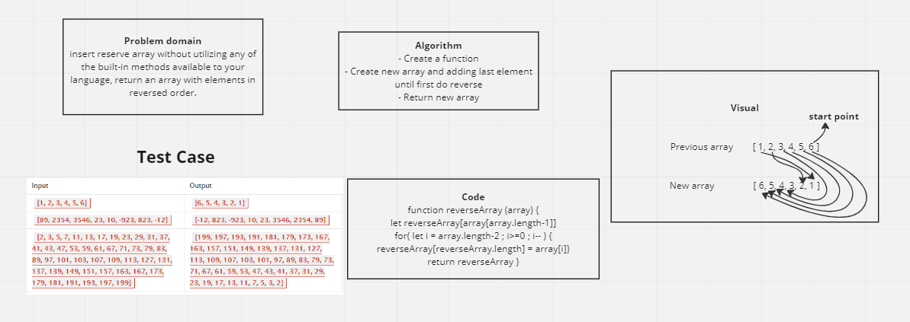

# Challenge Title

Write a function called reverseArray which takes an array as an argument. Without utilizing any of the built-in methods available to Java Script, return an array with elements in reversed order.

## Whiteboard Process

## Approach & Efficiency

Use new reverse Array that adding last element until first do reverse
then return new array

Big O :
Time >>> O(n)
Space >>> O(n)

Because size n

## Solution

<!-- function reverseArray (array) {
let reverseArray[array[array.length-1]]
for( let i = array.length-2 ; i>=0 ; i-- ) {
reverseArray[reverseArray.length] = array[i]
}
return reverseArray
} -->
